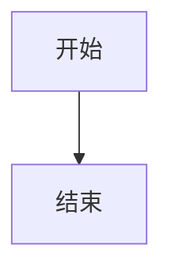

# 本地教学视频自动生成工具(Windows / macOS)

自动依次展示 `NN.md`(流程图)并播放 `NN.conversation`(双人对话语音),
全程录屏生成教学视频。

## 目录结构

```
video_maker/
  config.py          配置文件(音频设备名等在这里改)
  loader.py          解析 slides 文件夹
  tts_engine.py       edge-tts 封装(带缓存)
  player.py           播放语音(支持暂停/停止)
  recorder.py         ffmpeg 录屏封装
  control.py           播放中的暂停/停止控制
  server.py            Flask + WebSocket 服务
  main.py               入口,运行这个文件
  templates/index.html 浏览器展示页面
  slides/                 素材文件夹(示例已放了 01/02 两组)
  output/                  录制完的视频会保存到这里
  tts_cache/               生成过的语音缓存
```

## 快速开始(如果不想手动敲命令)

项目里附带了一键脚本:

- Windows:双击 `setup.bat`(第一次用时运行一次,创建虚拟环境并装依赖),
  之后双击 `run.bat` 启动
- macOS / Linux:终端里执行 `./setup.sh`(第一次用时运行一次),
  之后执行 `./run.sh` 启动(如果提示权限不足,先执行一次
  `chmod +x setup.sh run.sh`)

用了这两组脚本可以跳过下面"第一步"里的手动命令部分,直接看"第二步:确认可以录到系统声音"。

## 第一步:安装依赖

### 1. 创建项目专属的虚拟环境

避免和你电脑上其他 Python 项目的依赖互相冲突,建议在 `video_maker` 文件夹里
单独建一个虚拟环境。在 `video_maker` 目录下打开命令行(cmd 或 PowerShell):

```bash
python -m venv venv
```

执行后会在当前目录生成一个 `venv` 文件夹,这就是项目专用的 Python 环境。

**每次运行本项目前,都要先激活这个环境**:

cmd(Windows):
```bash
venv\Scripts\activate.bat
```

PowerShell(Windows):
```bash
venv\Scripts\Activate.ps1
```

macOS / Linux:
```bash
source venv/bin/activate
```

激活成功后,命令行提示符前面会出现 `(venv)` 字样。之后在**同一个窗口**里
执行的 `pip install` / `python main.py` 都只作用于这个独立环境,不会影响
你电脑上其他项目或全局 Python。

> Windows 下如果 PowerShell 提示"无法加载文件,因为在此系统上禁止运行脚本",
> 说明执行策略限制了脚本运行,可以改用 cmd 执行 `venv\Scripts\activate.bat`,
> 或者以管理员身份运行一次:
> `Set-ExecutionPolicy -Scope CurrentUser RemoteSigned`

不想用了想清理环境时,直接把 `venv` 文件夹删掉即可,不会影响系统其他部分。

### 2. 安装 Python 依赖(在已激活的 venv 里执行)

```bash
pip install -r requirements.txt
```

### 3. 安装 ffmpeg

Windows:从 https://ffmpeg.org/download.html 下载 Windows 版,解压后把
`bin` 目录加入系统 PATH。

macOS:推荐用 Homebrew 安装:

```bash
brew install ffmpeg
```

安装完在命令行输入以下命令确认(两个平台通用):

```bash
ffmpeg -version
```

能看到版本号说明安装成功。

## 第二步:确认可以录到系统声音(最容易出问题的一步)

### Windows

Windows 默认无法直接录制"系统正在播放的声音",需要装一个能采集系统声音的
驱动。下面这个方案**已经在实际环境验证过可以正常录到声音**,直接照做即可。

#### 推荐方案:安装 virtual-audio-capturer

优点:不依赖"默认播放设备是哪一张声卡"——不管你用蓝牙耳机、显示器音频还是
USB 音箱,只要是系统正在播放的声音都能录到,不需要额外切换/监听转发设置。

**安装步骤:**

1. 下载页面:https://github.com/rdp/screen-capture-recorder-to-video-windows-free/releases
   找最新的 `Setup.exe`
2. 双击安装(一路默认下一步就行)
3. 装完运行确认:

   ```bash
   ffmpeg -list_devices true -f dshow -i dummy
   ```

   输出里能看到 `virtual-audio-capturer` 就说明装好了

4. 确认 `config.py` 里的 `FFMPEG_AUDIO_DEVICE` 是:

   ```python
   FFMPEG_AUDIO_DEVICE = "virtual-audio-capturer"
   ```

   (项目里已经默认配置成这个了,一般不用改)

#### 备用方案(如果上面这个装不了或不想装新驱动)

**方案 A:启用"立体声混音"**
1. 右键任务栏喇叭图标 → 声音设置 → 更多声音设置
2. 切换到"录制"标签页 → 空白处右键 → "显示禁用的设备"
3. 如果看到"立体声混音",右键启用它

注意:立体声混音只能录到"某一张特定声卡"输出的声音,如果你的默认播放
设备切换成了蓝牙耳机、显示器音频这类不是这张声卡的设备,会录不到任何
声音(这也是本项目开发过程中实际遇到并确认过的坑)。用这个方案的话,
默认播放设备必须始终是立体声混音所在的那张声卡。

**方案 B:安装虚拟声卡 VB-Cable**
安装 [VB-Cable](https://vb-audio.com/Cable/)(免费),装完把默认播放设备
设成 `CABLE Input`,再在 `CABLE Output` 的属性里勾选"Listen to this device"
转发到你平时听声音的设备,这样自己还能听到声音,同时 ffmpeg 录 `CABLE Output`。
比方案 A 麻烦一些,但同样不受默认设备切换影响。

无论用哪个方案,确认好设备名后运行以下命令看 ffmpeg 能不能正常识别:

```bash
ffmpeg -list_devices true -f dshow -i dummy
```

在输出的 "DirectShow audio devices" 部分,把对应设备的**完整名称**
(包括括号里的内容)填入 `config.py` 里的:

```python
FFMPEG_AUDIO_DEVICE = "这里填你的设备全名"
```

### macOS

macOS 和 Windows 一样,默认也无法直接录制"系统正在播放的声音"
(不存在"立体声混音"这种内置方案),必须装一个虚拟声卡。

**安装步骤:**

1. 安装 [BlackHole](https://existential.audio/blackhole/)(免费虚拟声卡),
   推荐 2ch 版本,可以用 Homebrew 装:

   ```bash
   brew install blackhole-2ch
   ```

2. 打开"音频 MIDI 设置"(在 Spotlight 里搜索),创建一个"多输出设备",
   同时勾选你平时用的输出设备(如内建扬声器)和 BlackHole 2ch,这样录制
   的同时自己也能听到声音;然后把系统的默认输出设备切换成这个多输出设备。

3. 查看 ffmpeg 能识别到的设备索引:

   ```bash
   ffmpeg -f avfoundation -list_devices true -i ""
   ```

   输出里 "AVFoundation video devices" 下面找屏幕对应的索引(通常是
   `Capture screen 0`),"AVFoundation audio devices" 下面找 `BlackHole 2ch`
   对应的索引。

4. 把两个索引按 "视频索引:音频索引" 的格式填入 `config.py`:

   ```python
   FFMPEG_AVFOUNDATION_DEVICE = "1:0"  # 替换成你实际看到的索引
   ```

5. 第一次运行 `python main.py` 触发录屏时,macOS 会弹窗要求给终端 /
   Python 授予"屏幕录制"权限,去 系统设置 → 隐私与安全性 → 屏幕录制
   里勾选允许,授权后可能需要重启终端再运行一次。

## 第三步:准备素材

`slides/` 下不管嵌套多少层文件夹,程序都会递归扫描:只要某个目录下
直接放着 `NN.md`,这个目录就会出现在页面上的"课程"下拉框里,用相对
`slides/` 的路径显示(比如 "OCI课程包_对照AWS › 中文版"),点哪个就
直接用哪个目录里的内容,不需要每个课程都放在同一层深度,例如:

```
slides/
  OCI课程包_对照AWS/
    中文版/01.md, 01.conversation, 02.md, ...
    日文版/01.md, 01.conversation, ...
    英语版/01.md, 01.conversation, ...
  k8s-course/
    中文版/ ...
    日语版/ ...
    英语版/ ...
  托业单词/
    20260630/01.md, 01.conversation, ...
```

上面这个例子会出现 7 个课程选项("OCI课程包_对照AWS › 中文版"、
"OCI课程包_对照AWS › 日文版" ... "托业单词 › 20260630")。选好课程后,
`NN.conversation` 就是这个目录下的内容,不需要靠文件夹名字猜是哪种
语言,也不需要再额外加 `.zh`/`.ja`/`.en` 后缀(除非你就是想在同一个
目录里用后缀区分多语言,见下面的说明)。

**注意**:课程下拉框和后面的"录制语言"单选是两个独立的选择——课程
决定读哪个文件夹的内容,语言单选决定用哪种 TTS 音色朗读、字幕标签
显示成哪种语言。选了"OCI课程包_对照AWS › 日文版"却把语言单选留在
默认的"汉语",会变成用中文音色朗读这个文件夹里的日文内容,发音会不
对;想录日语版,记得把课程和语言两处都选成日语对应的选项。

`NN.md`(流程图)是三种语言共用的,不需要分语言准备。

不带语言后缀的 `NN.conversation` 是"通用兜底文件":页面上选了某种
语言时,如果没有对应的 `NN.conversation.<lang>`,就会退回读取
`NN.conversation` 的内容,并用选中语言的 TTS 音色朗读它 —— 注意这
**不是翻译**,只是用日语/英语的声音去读这份文件里原本的文字,发音
会比较奇怪,只建议临时用来验证流程,正式产出建议还是为每种语言准备
对应的 `NN.conversation.<lang>`。两者都没有时,那一组才会真正跳过
语音和字幕(命令行会打印警告)。

`NN.conversation.<lang>`(或不带后缀的 `NN.conversation`)格式示例:

```
speaker 1: 这是第一句话
speaker 2: 这是第二句回应
speaker 1: 可以换行继续这句话
          这一行还算 speaker 1 的内容
```

`NN.md` 里可以放流程图(mermaid 语法),会自动在浏览器里渲染成图:

<pre>

</pre>

`NN.md` 里也可以放选择题这类内容,支持标准 Markdown 任务列表语法和
`<details>` 折叠块,选项会渲染成真正可勾选的复选框,答案区默认折叠,
点击才展开:

<pre>
- [ ] A. 选项一
- [ ] B. 选项二

&lt;details&gt;
&lt;summary&gt;提交选择后查看结果&lt;/summary&gt;

- 正确答案:**B**
- 解析:这里可以正常用 markdown 语法(加粗、行内代码、列表等)

&lt;/details&gt;
</pre>

`<details>` 不需要手动加 `markdown="1"`,程序会自动处理,里面的
markdown(加粗、代码、列表)都能正常解析,不会显示成原始文字。

在页面"素材一览"最上面可以选"播放模式":

- **播放并录屏**(默认):和之前一样,开始录屏 + 依次播放 + 结束后停止录屏,
  用于正式产出视频,需要按前面第二步配置好 ffmpeg 录屏设备。
- **仅播放(不录屏)**:只依次显示流程图、播放语音、显示字幕,完全不启动
  ffmpeg,适合还没配置好录屏设备时快速预览素材、检查字幕/发音效果,
  或者单纯调试用。

下面才是选语言:点"开始"前可以选择本次用哪种语言
(汉语 / 日语 / 英语,默认汉语);选定后整段的语音和字幕都会
用这个语言(语音使用 `config.py` 里 `VOICE_MAP` 对应语言下的
edge-tts 声音)。

语言选择下面还有三个滑块可以调节语速 / 音量 / 音高(单位分别是
百分比 / 百分比 / Hz,默认都是 0 即不调整),三种语言共用同一组
数值,不需要分语言单独设置。滑块的取值范围、默认值都在 `config.py`
里的 `TTS_RATE_*` / `TTS_VOLUME_*` / `TTS_PITCH_*` 可以改。调整
这些参数后同一句话会重新生成语音(不会复用之前默认参数下的缓存)。

再下面是"播放章节"区间选择,页面上会显示当前一共有多少组素材,
两个下拉框选"从第几组"到"第几组"(下拉选项就是实际存在的编号,
不要求连续),只播放/录制这个区间内的章节,其余章节完全跳过
(不会显示、不会出声、不占用录制时长)。只想单独录一组的话,把
"从"和"到"两个下拉框选成同一个编号即可,比如都选第 10 组。默认
是从第一组到最后一组,也就是全部录制。选完区间和语言、参数后,
输出的视频文件名里会带上章节区间,例如 `..._ch4-6_...mp4`。播放/录制
过程中,页面右上角会一直显示当前进度,例如"第 2 / 共 3 组(第 5 组)"——
前一个数字是"这次选中的范围里播到第几个",后面括号里是该章节本身的
编号,播完会自动隐藏。

项目里已经放了两组示例(01、02),可以先直接跑一遍确认流程通了,
再替换成你自己的素材。

## 第四步:运行

```bash
python main.py
```

1. 会自动打开浏览器,显示"素材一览"页面
2. **把浏览器窗口最大化 / 按 F11 全屏**(录制的是整个屏幕,不是单独抓浏览器窗口)
3. 如果 `slides/` 下有多个课程文件夹,页面最上面会有"课程"下拉框,先选好课程
   (切换课程会刷新页面,重新显示该课程的章节预览和章节数)
4. 选好播放模式/语言/章节范围/语速音量音高后,点击"开始"按钮
5. 程序会依次显示每组流程图并播放对应语音,播放期间页面左上角会出现
   "暂停"/"停止"两个按钮:
   - **暂停**:再点一次会变成"继续",暂停时语音和翻页节奏都会停住;
     如果是"播放并录屏"模式,注意 ffmpeg 本身不会跟着暂停,画面会停在
     暂停那一刻直到你点"继续"(暂停这段时间也会被录进视频里,是静止画面)
   - **停止**:提前结束本次播放/录制,会弹窗确认;如果是"播放并录屏"
     模式,已经录到的部分会被正常保存成一个完整、可以播放的视频文件
     (不会损坏),只是比选择的章节范围短
   全部播完后(没有手动停止的话)会自动停止录制
6. 视频保存在 `output/` 文件夹里,文件名会自动加上语言/章节区间/时间戳,
   例如 `lesson_video_zh_ch1-7_20260730_153012.mp4`,每次点"开始"都会
   生成新文件,不会覆盖之前录的

## 排查:录出来的视频没有声音

按顺序排查,大部分情况第 1、2 步就能解决:

1. **单独测试 Stereo Mix 能不能录到声音**(跟这个项目无关,先确认设备本身没问题):
   一边放着音乐/视频,一边执行:
   ```bash
   ffmpeg -f dshow -i audio="Stereo Mix (Realtek(R) Audio)" -t 8 test.wav
   ```
   录完播放 `test.wav`,如果本身就是静音的,说明是系统设置问题,不是代码问题。

2. **检查 Stereo Mix 是否被静音、音量是否为 0**:
   声音设置 → 更多声音设置 → "录制" 标签页 → 双击 "Stereo Mix" → "级别" 标签页确认。

3. **检查默认播放设备和 Stereo Mix 是不是同一张声卡**:
   Stereo Mix 只能录制"当前默认播放设备"输出的声音。如果电脑默认输出是耳机 /
   USB 音箱 / HDMI,而不是这个 Realtek 声卡,Stereo Mix 就录不到任何东西。
   声音设置 → 输出,确认默认设备是 Realtek 这一类。

## 已知未验证 / 可能需要调整的地方

这套代码没有在真实 Windows / macOS 环境跑过,以下几点大概率需要现场调一下:

1. **`FFMPEG_AUDIO_DEVICE` 设备名(Windows)**:必须跟 `ffmpeg -list_devices` 输出完全一致,
   哪怕多一个空格都会报错。
2. **`FFMPEG_AVFOUNDATION_DEVICE` 设备索引(macOS)**:插拔外接显示器、切换音频输出
   设备都可能导致 `ffmpeg -f avfoundation -list_devices true -i ""` 里的索引号变化,
   如果突然录不到画面/声音,先重新跑一遍这个命令确认索引。
3. **ffmpeg 停止方式**:代码里用发送 `q` 给 ffmpeg 标准输入来正常结束录制
   (保证视频文件不损坏)。如果发现程序退出时视频没有正常保存/损坏,
   把 `recorder.py` 里 `stop()` 方法里的等待时间(`timeout=20`)调大一些试试。
4. **中文语音效果**:`edge-tts` 需要联网,如果公司网络有限制导致语音生成失败,
   会在运行时直接报错,需要换网络环境。
5. **性能**:如果 md 文件很多或语音很长,`veryfast` 编码预设兼顾了速度和文件大小,
   如果想要更小体积可以把 `recorder.py` 里的 `-preset veryfast` 换成 `medium`,
   但会更慢一些。

如果实际跑起来某一步报错,把报错信息发给我,我可以针对性地改。
