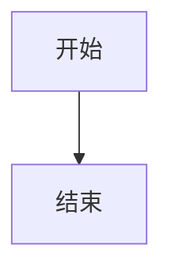

# 本地教学视频自动生成工具(Windows)

自动依次展示 `NN.md`(流程图)并播放 `NN.conversation`(双人对话语音),
全程录屏生成教学视频。

## 目录结构

```
video_maker/
  config.py          配置文件(音频设备名等在这里改)
  loader.py          解析 slides 文件夹
  tts_engine.py       edge-tts 封装(带缓存)
  player.py           播放语音
  recorder.py         ffmpeg 录屏封装
  server.py            Flask + WebSocket 服务
  main.py               入口,运行这个文件
  templates/index.html 浏览器展示页面
  slides/                 素材文件夹(示例已放了 01/02 两组)
  output/                  录制完的视频会保存到这里
  tts_cache/               生成过的语音缓存
```

## 快速开始(如果不想手动敲命令)

项目里附带了两个一键脚本(双击即可运行):

- `setup.bat` —— 第一次使用时运行一次,自动创建虚拟环境 `venv` 并安装依赖
- `run.bat` —— 之后每次运行项目,双击这个就行,会自动激活虚拟环境并启动 `main.py`

用了这两个脚本可以跳过下面"第一步"里的手动命令部分,直接看"第二步:确认可以录到系统声音"。

## 第一步:安装依赖

### 1. 创建项目专属的虚拟环境

避免和你电脑上其他 Python 项目的依赖互相冲突,建议在 `video_maker` 文件夹里
单独建一个虚拟环境。在 `video_maker` 目录下打开命令行(cmd 或 PowerShell):

```bash
python -m venv venv
```

执行后会在当前目录生成一个 `venv` 文件夹,这就是项目专用的 Python 环境。

**每次运行本项目前,都要先激活这个环境**:

cmd:
```bash
venv\Scripts\activate.bat
```

PowerShell:
```bash
venv\Scripts\Activate.ps1
```

激活成功后,命令行提示符前面会出现 `(venv)` 字样。之后在**同一个窗口**里
执行的 `pip install` / `python main.py` 都只作用于这个独立环境,不会影响
你电脑上其他项目或全局 Python。

> 如果 PowerShell 提示"无法加载文件,因为在此系统上禁止运行脚本",
> 说明执行策略限制了脚本运行,可以改用 cmd 执行 `venv\Scripts\activate.bat`,
> 或者以管理员身份运行一次:
> `Set-ExecutionPolicy -Scope CurrentUser RemoteSigned`

不想用了想清理环境时,直接把 `venv` 文件夹删掉即可,不会影响系统其他部分。

### 2. 安装 Python 依赖(在已激活的 venv 里执行)

```bash
pip install -r requirements.txt
```

### 3. 安装 ffmpeg

从 https://ffmpeg.org/download.html 下载 Windows 版,解压后把 `bin` 目录加入系统 PATH。
安装完在命令行输入以下命令确认:

```bash
ffmpeg -version
```

能看到版本号说明安装成功。

## 第二步:确认可以录到系统声音(最容易出问题的一步)

Windows 默认无法直接录制"系统正在播放的声音",需要装一个能采集系统声音的
驱动。下面这个方案**已经在实际环境验证过可以正常录到声音**,直接照做即可。

### 推荐方案:安装 virtual-audio-capturer

优点:不依赖"默认播放设备是哪一张声卡"——不管你用蓝牙耳机、显示器音频还是
USB 音箱,只要是系统正在播放的声音都能录到,不需要额外切换/监听转发设置。

**安装步骤:**

1. 下载页面:https://github.com/rdp/screen-capture-recorder-to-video-windows-free/releases
   找最新的 `Setup.exe`
2. 双击安装(一路默认下一步就行)
3. 装完运行确认:

   ```bash
   ffmpeg -list_devices true -f dshow -i dummy
   ```

   输出里能看到 `virtual-audio-capturer` 就说明装好了

4. 确认 `config.py` 里的 `FFMPEG_AUDIO_DEVICE` 是:

   ```python
   FFMPEG_AUDIO_DEVICE = "virtual-audio-capturer"
   ```

   (项目里已经默认配置成这个了,一般不用改)

### 备用方案(如果上面这个装不了或不想装新驱动)

**方案 A:启用"立体声混音"**
1. 右键任务栏喇叭图标 → 声音设置 → 更多声音设置
2. 切换到"录制"标签页 → 空白处右键 → "显示禁用的设备"
3. 如果看到"立体声混音",右键启用它

注意:立体声混音只能录到"某一张特定声卡"输出的声音,如果你的默认播放
设备切换成了蓝牙耳机、显示器音频这类不是这张声卡的设备,会录不到任何
声音(这也是本项目开发过程中实际遇到并确认过的坑)。用这个方案的话,
默认播放设备必须始终是立体声混音所在的那张声卡。

**方案 B:安装虚拟声卡 VB-Cable**
安装 [VB-Cable](https://vb-audio.com/Cable/)(免费),装完把默认播放设备
设成 `CABLE Input`,再在 `CABLE Output` 的属性里勾选"Listen to this device"
转发到你平时听声音的设备,这样自己还能听到声音,同时 ffmpeg 录 `CABLE Output`。
比方案 A 麻烦一些,但同样不受默认设备切换影响。

无论用哪个方案,确认好设备名后运行以下命令看 ffmpeg 能不能正常识别:

```bash
ffmpeg -list_devices true -f dshow -i dummy
```

在输出的 "DirectShow audio devices" 部分,把对应设备的**完整名称**
(包括括号里的内容)填入 `config.py` 里的:

```python
FFMPEG_AUDIO_DEVICE = "这里填你的设备全名"
```

## 第三步:准备素材

在 `slides/` 文件夹里放入成对的文件,编号任意但要成对:

```
slides/
  01.md
  01.conversation.zh
  01.conversation.ja
  01.conversation.en
  02.md
  02.conversation.zh
  02.conversation.ja
  02.conversation.en
  ...
```

`NN.md`(流程图)是三种语言共用的,不需要分语言准备。
`NN.conversation.<lang>` 是每种语言各一份对话文件,`<lang>` 为
`zh`(汉语)/ `ja`(日语)/ `en`(英语)。

不带语言后缀的 `NN.conversation` 是"通用兜底文件":页面上选了某种
语言时,如果没有对应的 `NN.conversation.<lang>`,就会退回读取
`NN.conversation` 的内容,并用选中语言的 TTS 音色朗读它 —— 注意这
**不是翻译**,只是用日语/英语的声音去读这份文件里原本的文字,发音
会比较奇怪,只建议临时用来验证流程,正式产出建议还是为每种语言准备
对应的 `NN.conversation.<lang>`。两者都没有时,那一组才会真正跳过
语音和字幕(命令行会打印警告)。

`NN.conversation.<lang>`(或不带后缀的 `NN.conversation`)格式示例:

```
speaker 1: 这是第一句话
speaker 2: 这是第二句回应
speaker 1: 可以换行继续这句话
          这一行还算 speaker 1 的内容
```

`NN.md` 里可以放流程图(mermaid 语法),会自动在浏览器里渲染成图:

<pre>

</pre>

在页面"素材一览"里,点"开始录制"前可以选择本次录制用哪种语言
(汉语 / 日语 / 英语,默认汉语);选定后整段视频的语音和字幕都会
用这个语言(语音使用 `config.py` 里 `VOICE_MAP` 对应语言下的
edge-tts 声音)。

项目里已经放了两组示例(01、02),可以先直接跑一遍确认流程通了,
再替换成你自己的素材。

## 第四步:运行

```bash
python main.py
```

1. 会自动打开浏览器,显示"素材一览"页面
2. **把浏览器窗口最大化 / 按 F11 全屏**(录制的是整个屏幕,不是单独抓浏览器窗口)
3. 点击"开始录制"按钮
4. 程序会依次显示每组流程图并播放对应语音,全部播完后自动停止录制
5. 视频保存在 `output/` 文件夹里,文件名会自动加上时间戳,例如
   `lesson_video_20260730_153012.mp4`,每次点击"开始录制"都会生成新文件,
   不会覆盖之前录的

## 排查:录出来的视频没有声音

按顺序排查,大部分情况第 1、2 步就能解决:

1. **单独测试 Stereo Mix 能不能录到声音**(跟这个项目无关,先确认设备本身没问题):
   一边放着音乐/视频,一边执行:
   ```bash
   ffmpeg -f dshow -i audio="Stereo Mix (Realtek(R) Audio)" -t 8 test.wav
   ```
   录完播放 `test.wav`,如果本身就是静音的,说明是系统设置问题,不是代码问题。

2. **检查 Stereo Mix 是否被静音、音量是否为 0**:
   声音设置 → 更多声音设置 → "录制" 标签页 → 双击 "Stereo Mix" → "级别" 标签页确认。

3. **检查默认播放设备和 Stereo Mix 是不是同一张声卡**:
   Stereo Mix 只能录制"当前默认播放设备"输出的声音。如果电脑默认输出是耳机 /
   USB 音箱 / HDMI,而不是这个 Realtek 声卡,Stereo Mix 就录不到任何东西。
   声音设置 → 输出,确认默认设备是 Realtek 这一类。

4. **看 ffmpeg 的运行日志**:每次运行后,`output/ffmpeg_log.txt` 里是 ffmpeg
   完整的运行输出,如果音频设备打开失败或者有相关警告,会记录在这里。

## 已知未验证 / 可能需要调整的地方

这套代码没有在真实 Windows 环境跑过,以下几点大概率需要现场调一下:

1. **`FFMPEG_AUDIO_DEVICE` 设备名**:必须跟 `ffmpeg -list_devices` 输出完全一致,
   哪怕多一个空格都会报错。
2. **ffmpeg 停止方式**:代码里用发送 `q` 给 ffmpeg 标准输入来正常结束录制
   (保证视频文件不损坏)。如果发现程序退出时视频没有正常保存/损坏,
   把 `recorder.py` 里 `stop()` 方法里的等待时间(`timeout=20`)调大一些试试。
3. **中文语音效果**:`edge-tts` 需要联网,如果公司网络有限制导致语音生成失败,
   会在运行时直接报错,需要换网络环境。
4. **性能**:如果 md 文件很多或语音很长,`veryfast` 编码预设兼顾了速度和文件大小,
   如果想要更小体积可以把 `recorder.py` 里的 `-preset veryfast` 换成 `medium`,
   但会更慢一些。

如果实际跑起来某一步报错,把报错信息发给我,我可以针对性地改。
