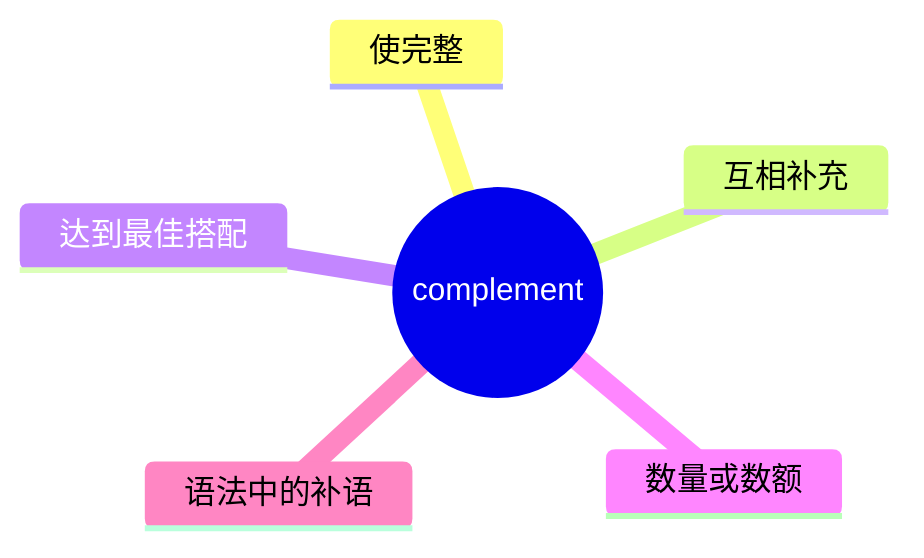
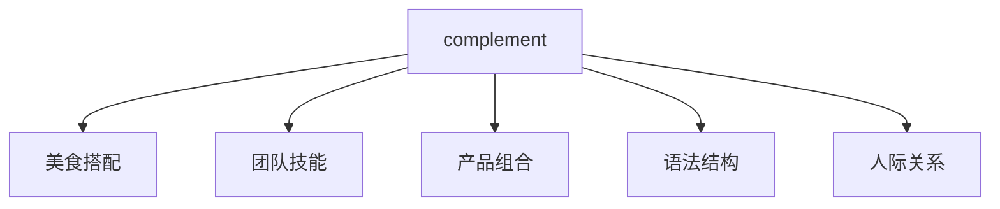
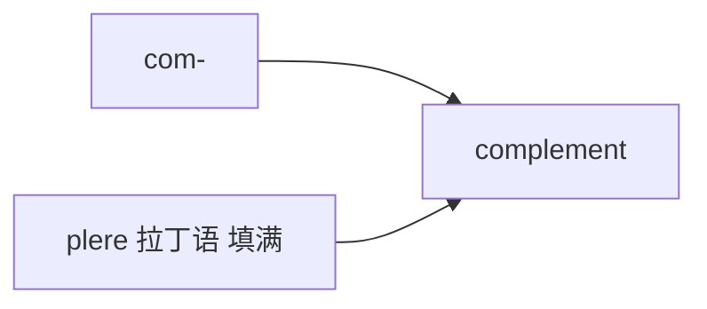
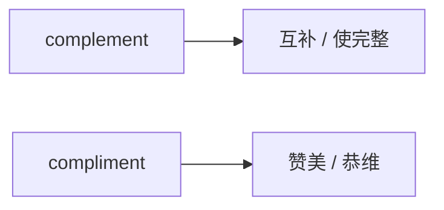

# complement

## 1. 单词卡片

| 项目 | 内容 |
|---|---|
| 单词 | complement |
| 词性 | noun / verb |
| 英式音标 | /ˈkɒmplɪmənt/ |
| 美式音标 | /ˈkɑːmplɪmənt/ |
| 音节 | com-ple-ment |
| 重音 | 第一音节 |
| 核心意思 | 补充、互补；使完整的事物 |

## 2. 发音拆解


发音提示：

* 重音在第一个音节 `COM`，读得清晰有力
* 第二、三音节是弱读，`ple` 和 `ment` 都读得轻而短
* 词尾 `-ment` 中的元音是弱读 `/ə/`，不要读成汉语的“们特”
* 中文近似音只能辅助记忆，不能代替标准发音：可以理解为“康普勒门特”，但真实发音更短促、更轻

## 3. 核心词义



## 4. 不同词性与用法

| 词性 | 英文含义 | 中文意思 | 常见结构 |
|---|---|---|---|
| verb | make something complete or better | 补充、使完美 | complement something |
| noun | something that completes | 补充物、互补的事物 | a perfect complement to |
| noun (语法) | a word/phrase completing meaning | 补语 | subject complement |

## 5. 常见使用语境



## 6. 常见搭配

| 搭配 | 中文意思 | 使用场景 |
|---|---|---|
| complement each other | 互相补充 | 团队、关系 |
| perfect complement | 完美的补充 | 描述搭配 |
| complement a dish | 为菜肴增色 | 美食 |
| complement the design | 与设计相得益彰 | 产品、建筑 |
| natural complement to | 自然的补充 | 正式写作 |

## 7. 核心句型

```text
complement + 名词
This wine complements the dish.
```

```text
be a complement to + 名词
Her skills are a complement to his experience.
```

## 8. 基础例句

**例句 1**

```text
Their skills **complement** each other perfectly.
```

他们的技能完美互补。

**例句 2**

```text
The sauce doesn't **complement** the fish.
```

这个酱汁和鱼肉不搭配。

## 9. 问答例句

**Question**

```text
How do these two colors complement each other?
```

这两种颜色是怎么互相搭配的？

**Answer**

```text
The blue and orange complement each other because they are opposite colors.
```

蓝色和橙色互相搭配，因为它们是互补色。

## 10. 工作场景

```text
Her design background **complements** the engineering team well.
```

她的设计背景很好地补充了工程团队的能力。

## 11. 日常生活场景

```text
This scarf really **complements** your jacket.
```

这条围巾和你的外套很搭。

## 12. 词根词缀与构词



| 单词 | 词性 | 中文意思 |
|---|---|---|
| complement | noun/verb | 补充、互补 |
| complementary | adjective | 互补的 |
| complementarity | noun | 互补性（较少见） |

`com-` 表示“共同、一起”，词根来自拉丁语 `plere`（填满），合起来表示“共同填满、使完整”。

## 13. 同义词辨析

| 单词 | 主要区别 |
|---|---|
| complement | 强调互相补充、使整体更完整 |
| supplement | 强调额外补充，不一定互补 |
| enhance | 强调提升效果，不一定成对出现 |
| accompany | 强调伴随，不一定有互补关系 |

## 14. 反义词

没有非常固定的反义词，可以理解为与 `clash with`（不协调、冲突）相对。

| 单词 | 中文意思 |
|---|---|
| clash | 冲突、不协调 |
| contradict | 矛盾 |

## 15. 易混淆点

```text
complement
```

补充、互补（名词/动词），与“完整 complete”同源。

```text
compliment
```

赞美、恭维（名词/动词），发音完全相同，拼写不同。



## 16. 常见错误

错误：

```text
Thank you for your complement on my work.
```

正确：

```text
Thank you for your compliment on my work.
```

说明：

表示“赞美”时应该用 `compliment`，不是 `complement`。这是汉语母语学习者最常混淆的一对同音词。

## 17. 记忆方法

```text
complement = com(共同) + plete(完整) → 共同使其完整 → 互补
```

场景记忆：

```text
Their skills complement each other.
他们的技能互相补充。
```

记住：`complement` 里有 `comple`，和 `complete`（完整）同源，帮助区分它和 `compliment`（赞美）。

## 18. 快速复习

| 问题 | 答案 |
|---|---|
| 核心意思是什么 | 补充、互补，使完整 |
| 常见词性是什么 | 名词、动词 |
| 常见搭配是什么 | complement each other |
| 容易和什么词混淆 | compliment（赞美） |
