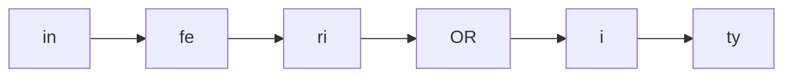
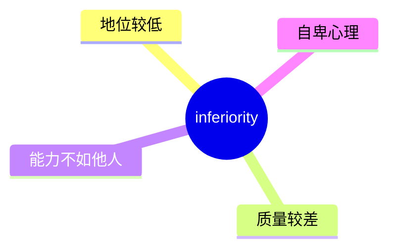
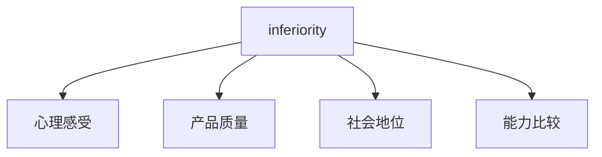
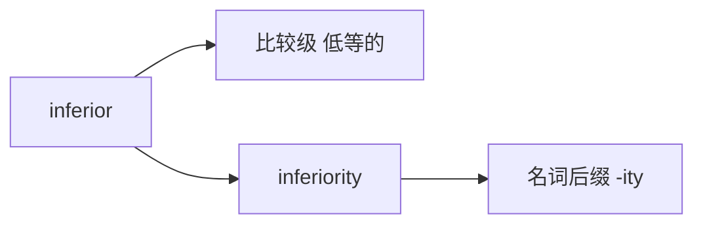

# inferiority

## 1. 单词卡片

| 项目 | 内容 |
|---|---|
| 单词 | inferiority |
| 词性 | noun |
| 英式音标 | /ɪnˌfɪəriˈɒrəti/ |
| 美式音标 | /ɪnˌfɪriˈɔːrəti/ |
| 音节 | in-fe-ri-or-i-ty |
| 重音 | 倒数第二个音节 `or` |
| 核心意思 | 低劣、次等；地位或质量上的低下 |

## 2. 发音拆解



发音提示：

* 这是一个长单词，重音落在 `OR` 这个音节上
* 英式发音中间有一个 `/ɪə/` 双元音，美式发音则更接近单元音 `/ɪ/`
* 词尾 `-ity` 读作轻快的 `/əti/`，不要拖长
* 中文近似音只能辅助记忆，不能代替标准发音：可以理解为“因菲瑞奥瑞提”，但真实发音音节更紧凑

## 3. 核心词义



## 4. 不同词性与用法

| 词性 | 英文含义 | 中文意思 | 常见结构 |
|---|---|---|---|
| noun | the state of being lower in quality/status | 低劣、次等地位 | a sense of inferiority |
| noun (心理学) | feeling of not being as good as others | 自卑感 | inferiority complex |

## 5. 常见使用语境



## 6. 常见搭配

| 搭配 | 中文意思 | 使用场景 |
|---|---|---|
| inferiority complex | 自卑情结 | 心理、日常交流 |
| a sense of inferiority | 一种自卑感 | 情感表达 |
| feelings of inferiority | 自卑的感觉 | 心理、正式写作 |
| inferiority to something | 相对某事物的低劣 | 比较、评价 |

## 7. 基础例句

**例句 1**

```text
He struggled with feelings of **inferiority** around his older brother.
```

他在哥哥面前一直有自卑感。

**例句 2**

```text
She doesn't have an **inferiority** complex at all.
```

她完全没有自卑情结。

## 8. 问答例句

**Question**

```text
Why do some people develop a sense of inferiority?
```

为什么有些人会产生自卑感？

**Answer**

```text
It often comes from constant comparison with others, especially during childhood.
```

这通常来自不断和他人比较，尤其是在童年时期。

## 9. 工作场景

```text
New employees sometimes feel a sense of **inferiority** compared to experienced colleagues.
```

新员工有时会觉得自己不如经验丰富的同事。

## 10. 日常生活场景

```text
Don't let feelings of **inferiority** stop you from trying new things.
```

不要让自卑感阻止你尝试新事物。

## 11. 词根词缀与构词



| 单词 | 词性 | 中文意思 |
|---|---|---|
| inferior | adjective | 低等的、次等的 |
| inferiority | noun | 低劣、自卑 |
| superior | adjective | 更优秀的（反义） |

`inferior` 来自拉丁语比较级词根 `inferus`（下方的），本身就带有比较意味；加上名词后缀 `-ity` 构成抽象名词 `inferiority`。

## 12. 同义词辨析

| 单词 | 主要区别 |
|---|---|
| inferiority | 强调状态，常用于心理和正式比较 |
| shame | 强调羞耻感，情绪更强烈 |
| inadequacy | 强调“能力不足”，更偏向自我怀疑 |

## 13. 反义词

| 单词 | 中文意思 |
|---|---|
| superiority | 优越、优越感 |
| confidence | 自信 |

## 14. 易混淆点

```text
inferior (adjective)
```

低等的，用来形容人或事物。

```text
inferiority (noun)
```

抽象名词，表示“低劣的状态”或“自卑感”。

## 15. 常见错误

错误：

```text
He feels very inferiority.
```

正确：

```text
He feels very inferior.
```

说明：

`inferiority` 是名词，不能直接放在系动词后面做表语；表示“感觉低人一等”应使用形容词 `inferior`。

## 16. 记忆方法

```text
inferior（低等的）+ -ity（抽象名词后缀）= inferiority（低劣、自卑）
```

场景记忆：

```text
He struggled with feelings of inferiority.
他一直有自卑感。
```

## 17. 快速复习

| 问题 | 答案 |
|---|---|
| 核心意思是什么 | 低劣、次等地位；自卑感 |
| 常见词性是什么 | 名词 |
| 常见搭配是什么 | inferiority complex |
| 容易犯的错误是什么 | 误用作形容词，应使用 inferior |
