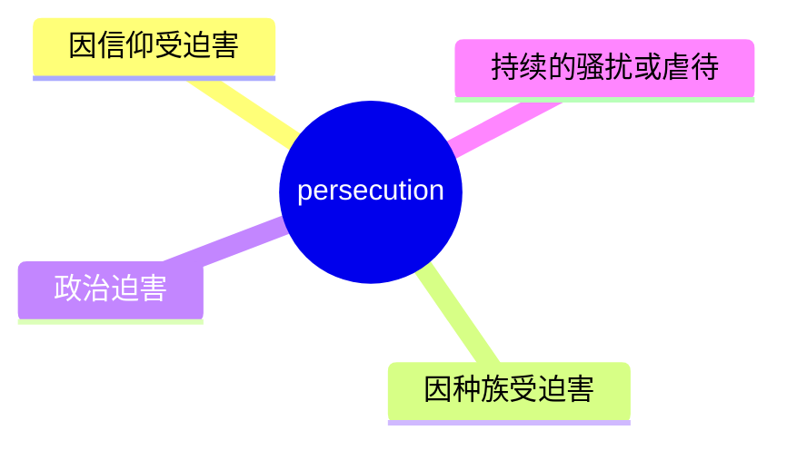
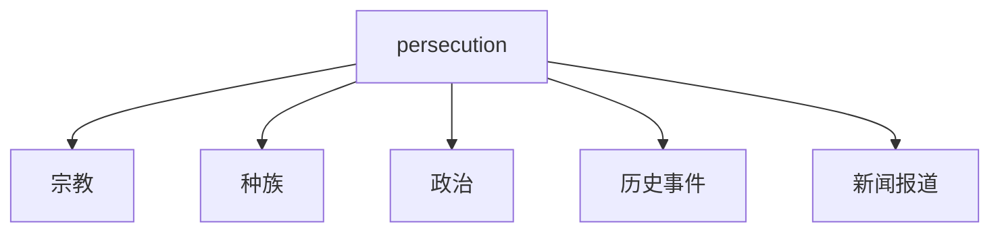
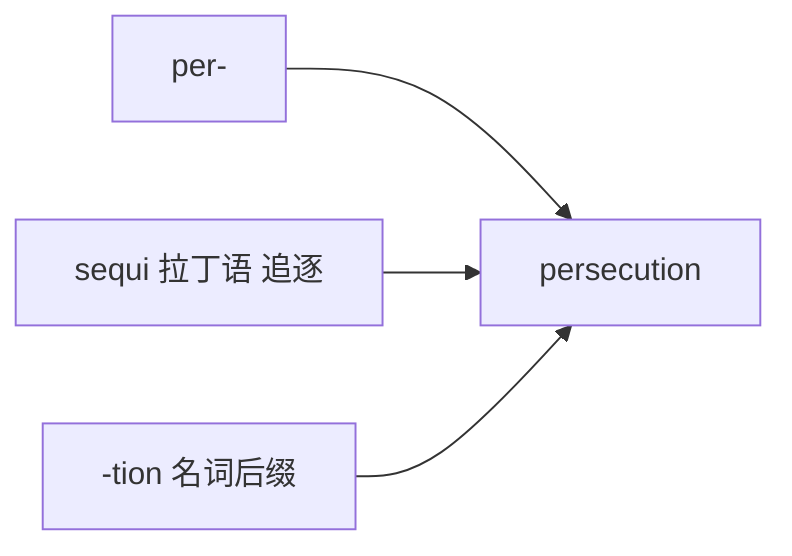

# persecution

## 1. 单词卡片

| 项目 | 内容 |
|---|---|
| 单词 | persecution |
| 词性 | noun |
| 英式音标 | /ˌpɜːsɪˈkjuːʃn/ |
| 美式音标 | /ˌpɜːrsɪˈkjuːʃn/ |
| 音节 | per-se-cu-tion |
| 重音 | 第三音节 `cu` |
| 核心意思 | 迫害、迫害行为，通常因种族、宗教或政治立场而遭受 |

## 2. 发音拆解


发音提示：

* 重音在第三个音节 `CU`，读作 /kjuː/
* 词尾 `-tion` 读作 /ʃn/，不要读成汉语拼音的“提翁”
* 美式发音中 `per` 里的 `r` 需要卷舌，英式发音则不卷舌
* 中文近似音只能辅助记忆，不能代替标准发音：可以理解为“泼西Q申”，但真实发音更连贯流畅

## 3. 核心词义



## 4. 不同词性与用法

| 词性 | 英文含义 | 中文意思 | 常见结构 |
|---|---|---|---|
| noun | hostile treatment because of beliefs/identity | 迫害 | religious persecution |
| noun | continuous harassment | 持续的骚扰 | a campaign of persecution |

## 5. 常见使用语境



## 6. 常见搭配

| 搭配 | 中文意思 | 使用场景 |
|---|---|---|
| religious persecution | 宗教迫害 | 历史、新闻 |
| political persecution | 政治迫害 | 新闻、时事 |
| flee persecution | 逃离迫害 | 难民话题 |
| face persecution | 面临迫害 | 正式写作 |
| suffer persecution | 遭受迫害 | 正式写作 |

## 7. 基础例句

**例句 1**

```text
The refugees fled religious **persecution** in their home country.
```

难民们逃离了祖国的宗教迫害。

**例句 2**

```text
The government denied any involvement in the **persecution** of minorities.
```

政府否认参与了对少数群体的迫害。

## 8. 问答例句

**Question**

```text
Why did so many people leave the country in that period?
```

为什么那个时期有那么多人离开这个国家？

**Answer**

```text
Many were escaping political persecution and could no longer feel safe at home.
```

许多人是为了逃离政治迫害，在家乡已经无法感到安全。

## 9. 工作场景

```text
The report documents cases of workplace **persecution** based on gender.
```

这份报告记录了基于性别的职场迫害案例。

## 10. 日常生活场景

```text
She talked about the years of **persecution** her grandparents had endured.
```

她讲述了祖父母经历过的多年迫害。

## 11. 词根词缀与构词



| 单词 | 词性 | 中文意思 |
|---|---|---|
| persecute | verb | 迫害 |
| persecution | noun | 迫害（行为） |
| persecutor | noun | 迫害者 |

`per-` 表示“彻底、贯穿”，词根 `sequi` 来自拉丁语“追逐”，合起来是“持续追逐、迫害”。

## 12. 同义词辨析

| 单词 | 主要区别 |
|---|---|
| persecution | 强调因身份或信仰而遭受的系统性伤害 |
| oppression | 强调权力压制，范围更广，不一定针对个人身份 |
| harassment | 强调反复骚扰，程度不一定像 persecution 那么严重 |

## 13. 反义词

没有非常固定的反义词，语境中常与以下概念相对：

| 单词 | 中文意思 |
|---|---|
| protection | 保护 |
| tolerance | 宽容 |

## 14. 易混淆点

```text
persecution
```

迫害，多用于宗教、种族、政治语境。

```text
prosecution
```

起诉、检方，法律语境中的“公诉”。

两个词拼写相似，容易看错，一定要注意 `per-` 和 `pro-` 的区别。

## 15. 常见错误

错误：

```text
He was persecution by his enemies.
```

正确：

```text
He was persecuted by his enemies.
```

说明：

`persecution` 是名词，被动语态需要用动词 `persecute` 的过去分词 `persecuted`。

## 16. 记忆方法

```text
per(彻底) + secut(追逐) + ion(名词后缀) = persecution（持续追逐迫害）
```

场景记忆：

```text
The refugees fled religious persecution.
难民们逃离了宗教迫害。
```

## 17. 快速复习

| 问题 | 答案 |
|---|---|
| 核心意思是什么 | 迫害，因身份、信仰而遭受的伤害 |
| 常见词性是什么 | 名词 |
| 常见搭配是什么 | religious persecution / flee persecution |
| 容易混淆的词是什么 | prosecution（起诉） |
