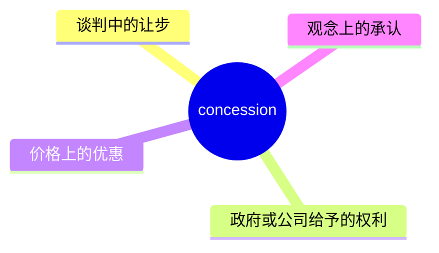
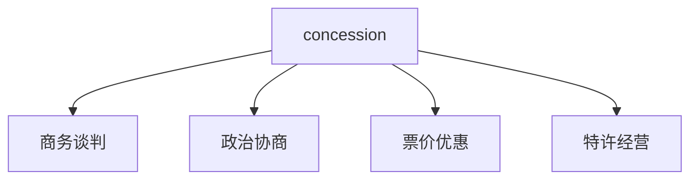
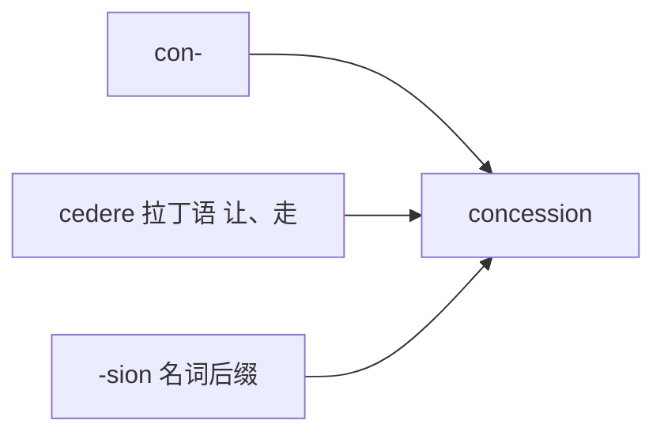

# concession

## 1. 单词卡片

| 项目 | 内容 |
|---|---|
| 单词 | concession |
| 词性 | noun |
| 英式音标 | /kənˈseʃn/ |
| 美式音标 | /kənˈseʃn/（基本相同） |
| 音节 | con-ces-sion |
| 重音 | 第二音节 `ces` |
| 核心意思 | 让步、妥协；给予的权利或优惠 |

## 2. 发音拆解


发音提示：

* 重音在第二个音节 `CE`，读作 /se/
* 词尾 `-ssion` 读作 /ʃn/，和 persecution 中的 `-tion` 发音类似
* 第一个音节 `con` 是弱读，读作 /kən/，不要重读成“康”
* 中文近似音只能辅助记忆，不能代替标准发音：可理解为“肯塞申”，但真实发音第一音节更轻

## 3. 核心词义



## 4. 不同词性与用法

| 词性 | 英文含义 | 中文意思 | 常见结构 |
|---|---|---|---|
| noun | something given up in negotiation | 让步 | make a concession |
| noun | a right granted by authority | 特许权、经营权 | mining concession |
| noun | a discount/reduced price | 优惠票价 | student concession |

## 5. 常见使用语境



## 6. 常见搭配

| 搭配 | 中文意思 | 使用场景 |
|---|---|---|
| make a concession | 做出让步 | 谈判 |
| win concessions | 获得让步 | 谈判、劳资关系 |
| major concession | 重大让步 | 正式写作 |
| concession ticket | 优惠票 | 生活、旅行 |
| mining concession | 采矿特许权 | 商业、法律 |

## 7. 基础例句

**例句 1**

```text
The union won several **concessions** from management, including higher wages.
```

工会从管理层那里赢得了几项让步，包括加薪。

**例句 2**

```text
Neither side was willing to make a **concession**.
```

双方都不愿意做出让步。

## 8. 问答例句

**Question**

```text
Did the company make any concessions during the negotiation?
```

公司在谈判中做出了任何让步吗？

**Answer**

```text
Yes, they agreed to extend the deadline as a concession.
```

是的，他们同意延长期限，作为一种让步。

## 9. 工作场景

```text
We may need to make a small **concession** to close this deal.
```

为了达成这笔交易，我们可能需要做出一点小让步。

## 10. 日常生活场景

```text
Students can buy a **concession** ticket for the museum.
```

学生可以购买博物馆的优惠票。

## 11. 词根词缀与构词



| 单词 | 词性 | 中文意思 |
|---|---|---|
| concede | verb | 让步、承认 |
| concession | noun | 让步、特许权 |
| concessionary | adjective | 优惠的 |

词根 `cedere` 来自拉丁语，意思是“走、让”，`con-` 表示“共同”，合起来表示“共同退让”。

## 12. 同义词辨析

| 单词 | 主要区别 |
|---|---|
| concession | 正式，常用于谈判、政治、商业 |
| compromise | 强调双方各让一步，达成折中方案 |
| allowance | 强调允许或给予的额度，语气较中性 |

## 13. 反义词

| 单词 | 中文意思 |
|---|---|
| refusal | 拒绝 |
| insistence | 坚持 |

## 14. 易混淆点

```text
concession
```

让步，名词，谈判和优惠票语境常用。

```text
compromise
```

妥协、折中方案，强调双方都让步，达成共同结果。

`concession` 更强调单方面的让步，`compromise` 更强调双方共同达成的结果。

## 15. 常见错误

错误：

```text
He made a concession to admit his mistake.
```

正确：

```text
He admitted his mistake as a concession.
```

或更自然的说法：

```text
He conceded that he had made a mistake.
```

说明：

`make a concession` 后面通常接名词或介词短语，不直接接 `to do`；如果想表达“承认”，用动词 `concede` 更自然。

## 16. 记忆方法

```text
con(共同) + cess(走、让) + ion(名词后缀) = concession（共同退让）
```

场景记忆：

```text
The union won several concessions from management.
工会从管理层那里赢得了几项让步。
```

## 17. 快速复习

| 问题 | 答案 |
|---|---|
| 核心意思是什么 | 让步；特许权；优惠 |
| 常见词性是什么 | 名词 |
| 常见搭配是什么 | make a concession / concession ticket |
| 和 compromise 的区别 | concession 强调单方让步，compromise 强调双方折中 |
