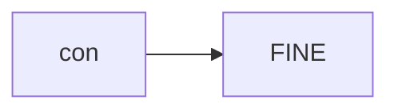
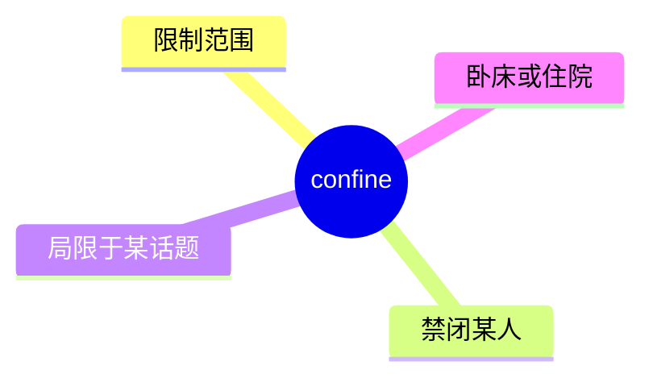
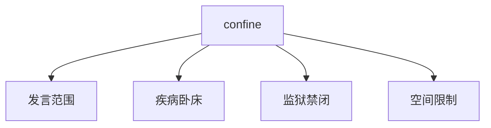
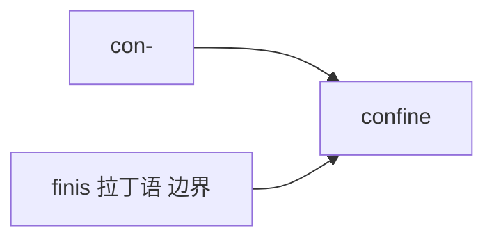

# confine

## 1. 单词卡片

| 项目 | 内容 |
|---|---|
| 单词 | confine |
| 词性 | verb / noun (常用复数 confines) |
| 英式音标 | 动词 /kənˈfaɪn/，名词 /ˈkɒnfaɪnz/ |
| 美式音标 | 动词 /kənˈfaɪn/，名词 /ˈkɑːnfaɪnz/ |
| 音节 | con-fine |
| 重音 | 动词重音在第二音节，名词重音在第一音节 |
| 核心意思 | 限制、限定；把……关在某个范围内 |

## 2. 发音拆解



发音提示：

* 作动词时重音在第二个音节 `FINE`，读作 /faɪn/，和单词 fine 发音相同
* 作名词（confines，边界、范围）时重音移到第一个音节 `CON`
* 第一个音节作动词使用时是弱读 /kən/
* 中文近似音只能辅助记忆，不能代替标准发音：可理解为“肯凡”，但真实发音中 fine 部分要清晰饱满

## 3. 核心词义



## 4. 不同词性与用法

| 词性 | 英文含义 | 中文意思 | 常见结构 |
|---|---|---|---|
| verb | keep within limits | 限制、限定 | confine oneself to |
| verb (被动) | keep someone somewhere | 关押、禁闭 | be confined to bed |
| noun (常用复数) | the limits of an area | 界限、范围 | within the confines of |

## 5. 常见使用语境



## 6. 常见搭配

| 搭配 | 中文意思 | 使用场景 |
|---|---|---|
| confine oneself to | 把自己限制在……范围内 | 讨论、写作 |
| be confined to bed | 卧床不起 | 医疗、健康 |
| confine the discussion to | 把讨论限制在……范围内 | 会议、正式场合 |
| within the confines of | 在……的范围/局限之内 | 正式写作 |

## 7. 基础例句

**例句 1**

```text
Please **confine** your remarks to the topic at hand.
```

请把你的发言限制在当前的话题范围内。

**例句 2**

```text
He was **confined** to bed for a week after the surgery.
```

手术后他卧床了一个星期。

## 8. 问答例句

**Question**

```text
Why was the patient confined to the hospital for so long?
```

为什么这位病人在医院住了这么久？

**Answer**

```text
The doctors confined him to the hospital because his condition was still unstable.
```

医生让他继续住院，因为他的病情仍不稳定。

## 9. 工作场景

```text
Let's **confine** today's meeting to the budget issue only.
```

我们今天的会议就只讨论预算问题吧。

## 10. 日常生活场景

```text
The heavy rain **confined** us to the house all weekend.
```

大雨把我们困在了家里，整个周末都没能出门。

## 11. 词根词缀与构词



| 单词 | 词性 | 中文意思 |
|---|---|---|
| confine | verb | 限制、禁闭 |
| confined | adjective | 狭小的、受限的 |
| confinement | noun | 监禁、限制状态 |

`con-` 表示“加强语气”，词根 `finis` 来自拉丁语“边界、终点”，和 `finish`、`final` 同源，合起来表示“划定边界、限制在内”。

## 12. 同义词辨析

| 单词 | 主要区别 |
|---|---|
| confine | 强调限制在一个范围内，语气较正式 |
| restrict | 常用于规则或政策上的限制 |
| limit | 最常用、最口语化的限制表达 |
| imprison | 强调关押在监狱，程度更强 |

## 13. 反义词

| 单词 | 中文意思 |
|---|---|
| release | 释放 |
| free | 使自由 |

## 14. 易混淆点

```text
confine (verb)
```

限制、禁闭，重音在第二音节。

```text
confines (noun, 常用复数)
```

界限、范围，重音在第一音节，比如 within the confines of the city。

## 15. 常见错误

错误：

```text
The rule confine us to stay quiet.
```

正确：

```text
The rule confines us to staying quiet.
```

说明：

`confine` 作及物动词，第三人称单数需要加 `-s`；后面接名词或动名词（`-ing`），一般不直接接不带 to 的动词原形。

## 16. 记忆方法

```text
con(加强) + fine(边界，来自 finis) = confine（划定边界、限制在内）
```

场景记忆：

```text
Please confine your remarks to the topic at hand.
请把你的发言限制在当前的话题范围内。
```

## 17. 快速复习

| 问题 | 答案 |
|---|---|
| 核心意思是什么 | 限制、限定；禁闭 |
| 常见词性是什么 | 动词（也有名词复数形式 confines） |
| 常见搭配是什么 | confine oneself to / be confined to bed |
| 容易犯的错误是什么 | 忘记加 -s 或后面直接接动词原形 |
