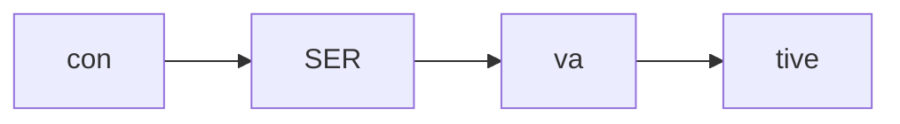
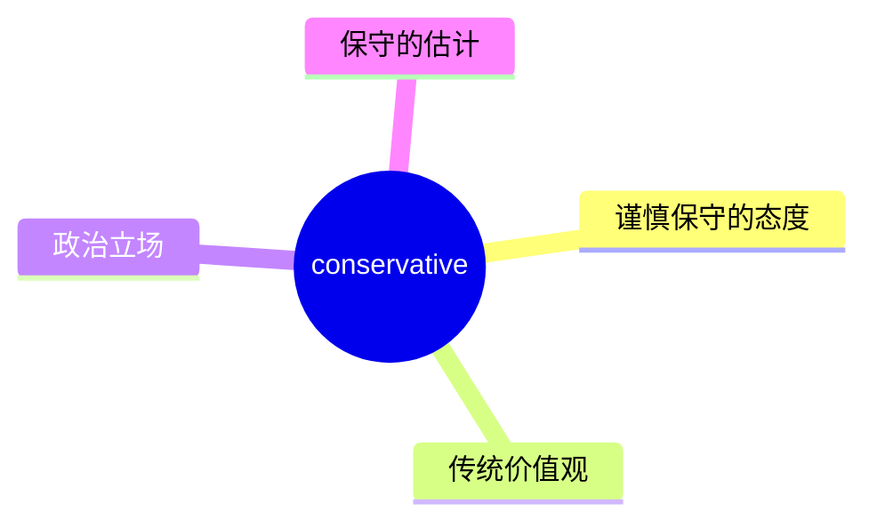
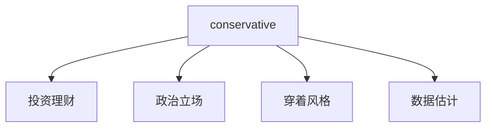
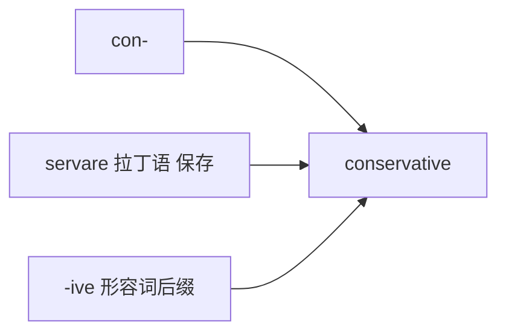

# conservative

## 1. 单词卡片

| 项目 | 内容 |
|---|---|
| 单词 | conservative |
| 词性 | adjective / noun |
| 英式音标 | /kənˈsɜːvətɪv/ |
| 美式音标 | /kənˈsɜːrvətɪv/ |
| 音节 | con-ser-va-tive |
| 重音 | 第二音节 `ser` |
| 核心意思 | 保守的、谨慎的、不喜欢改变的 |

## 2. 发音拆解



发音提示：

* 重音在第二个音节 `SER`，英式读作 /sɜː/，美式读作 /sɜːr/，需要卷舌
* 第一个音节 `con` 弱读为 /kən/
* 最后一个音节 `tive` 读作轻快的 /tɪv/，不要拖长
* 中文近似音只能辅助记忆，不能代替标准发音：可理解为“肯瑟弗提夫”，但真实发音更连贯

## 3. 核心词义



## 4. 不同词性与用法

| 词性 | 英文含义 | 中文意思 | 常见结构 |
|---|---|---|---|
| adjective | opposed to change, cautious | 保守的、谨慎的 | a conservative approach |
| adjective | traditional in style | 传统的 | conservative dress |
| noun | a person with traditional/cautious views | 保守派人士 | a conservative |

## 5. 常见使用语境



## 6. 常见搭配

| 搭配 | 中文意思 | 使用场景 |
|---|---|---|
| a conservative approach | 保守的做法 | 商务、决策 |
| conservative estimate | 保守估计 | 数据、报告 |
| politically conservative | 政治上保守 | 时事、新闻 |
| conservative investment | 保守型投资 | 理财 |

## 7. 基础例句

**例句 1**

```text
She took a **conservative** approach, investing only in low-risk bonds.
```

她采取了保守的做法，只投资低风险债券。

**例句 2**

```text
A **conservative** estimate suggests the project will take six months.
```

保守估计这个项目需要六个月。

## 8. 问答例句

**Question**

```text
Is he politically conservative or liberal?
```

他在政治上是保守派还是自由派？

**Answer**

```text
He describes himself as fairly conservative on economic issues.
```

他自称在经济议题上相当保守。

## 9. 工作场景

```text
Let's use a **conservative** number for the sales forecast.
```

销售预测我们用一个保守的数字吧。

## 10. 日常生活场景

```text
Her parents have quite **conservative** views about dating.
```

她父母对恋爱这件事的看法相当保守。

## 11. 词根词缀与构词



| 单词 | 词性 | 中文意思 |
|---|---|---|
| conserve | verb | 保存、节约 |
| conservative | adjective/noun | 保守的；保守派 |
| conservation | noun | 保护、保育 |

`con-` 表示“共同”，词根 `servare` 来自拉丁语“保存”，合起来强调“倾向于保持现状、不轻易改变”。

## 12. 同义词辨析

| 单词 | 主要区别 |
|---|---|
| conservative | 强调谨慎、不愿冒险，常用于态度、政治、估算 |
| cautious | 强调小心谨慎，范围更广，不限于观念立场 |
| traditional | 强调遵循传统，不一定涉及态度上的谨慎 |

## 13. 反义词

| 单词 | 中文意思 |
|---|---|
| liberal | 自由派的、开放的 |
| radical | 激进的 |
| progressive | 进步的、革新的 |

## 14. 易混淆点

```text
conservative
```

保守的（形容词），或“保守派人士”（名词）。

```text
conservation
```

保护、保育，常用于环境话题，比如 wildlife conservation。

两个词词根相同，但意思和用法不同，注意不要混用。

## 15. 常见错误

错误：

```text
He is very conservation about spending money.
```

正确：

```text
He is very conservative about spending money.
```

说明：

表示“保守的”应使用形容词 `conservative`，`conservation` 是名词，意思是“保护、保育”，二者不能互换。

## 16. 记忆方法

```text
con(共同) + serv(保存) + ative(形容词后缀) = conservative（倾向保持现状的）
```

场景记忆：

```text
She took a conservative approach, investing only in low-risk bonds.
她采取了保守的做法，只投资低风险债券。
```

## 17. 快速复习

| 问题 | 答案 |
|---|---|
| 核心意思是什么 | 保守的、谨慎的 |
| 常见词性是什么 | 形容词、名词 |
| 常见搭配是什么 | conservative estimate / conservative approach |
| 容易混淆的词是什么 | conservation（保护、保育） |
