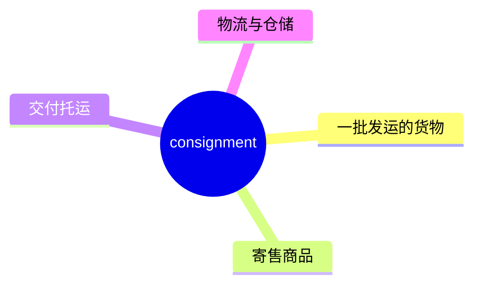
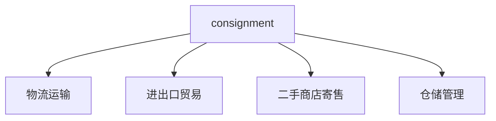
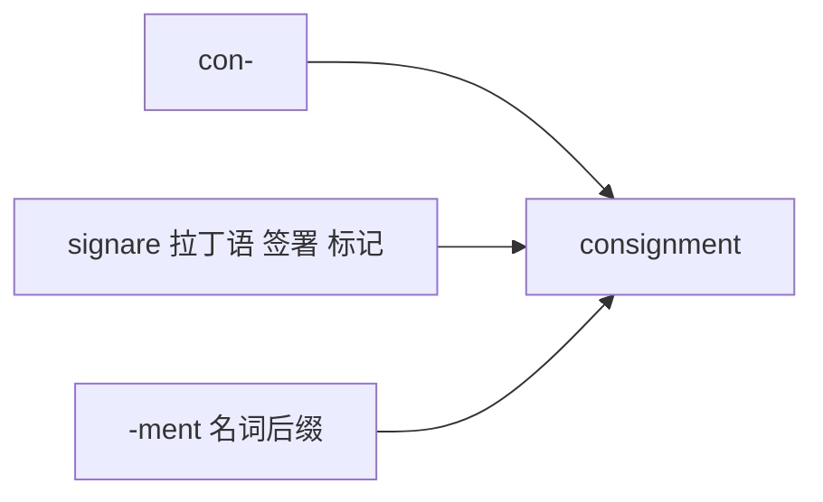

# consignment

## 1. 单词卡片

| 项目 | 内容 |
|---|---|
| 单词 | consignment |
| 词性 | noun |
| 英式音标 | /kənˈsaɪnmənt/ |
| 美式音标 | /kənˈsaɪnmənt/（基本相同） |
| 音节 | con-sign-ment |
| 重音 | 第二音节 `sign` |
| 核心意思 | 交付运输的一批货物；寄售 |

## 2. 发音拆解


发音提示：

* 重音在第二个音节 `SIGN`，读作 /saɪn/，和单词 sign 发音相同
* 第一个音节弱读为 /kən/
* 词尾 `-ment` 读作弱读的 /mənt/，不要重读
* 中文近似音只能辅助记忆，不能代替标准发音：可理解为“肯赛门特”，但真实发音中 sign 部分要清晰

## 3. 核心词义



## 4. 不同词性与用法

| 词性 | 英文含义 | 中文意思 | 常见结构 |
|---|---|---|---|
| noun | a batch of goods sent/delivered | 一批货物 | a consignment of goods |
| noun | goods sent for sale, paid later | 寄售 | sell on consignment |

## 5. 常见使用语境



## 6. 常见搭配

| 搭配 | 中文意思 | 使用场景 |
|---|---|---|
| a consignment of goods | 一批货物 | 贸易、物流 |
| receive a consignment | 收到一批货物 | 仓储、进口 |
| sell on consignment | 寄售 | 零售、二手商店 |
| consignment note | 托运单 | 物流单据 |

## 7. 基础例句

**例句 1**

```text
The store received a new **consignment** of winter coats.
```

商店收到了一批新的冬季外套。

**例句 2**

```text
These paintings are sold on **consignment**.
```

这些画作是以寄售方式出售的。

## 8. 问答例句

**Question**

```text
When is the next consignment of parts expected to arrive?
```

下一批零件预计什么时候到？

**Answer**

```text
The consignment should arrive by the end of this week.
```

这批货应该在本周末之前到达。

## 9. 工作场景

```text
We need to inspect the **consignment** before it leaves the warehouse.
```

我们需要在货物离开仓库之前检查这批货。

## 10. 日常生活场景

```text
She sells old clothes at a **consignment** shop downtown.
```

她在市中心的一家寄售店卖旧衣服。

## 11. 词根词缀与构词



| 单词 | 词性 | 中文意思 |
|---|---|---|
| consign | verb | 委托运送、寄售 |
| consignment | noun | 一批货物、寄售 |
| consignor | noun | 发货人、寄售人 |
| consignee | noun | 收货人 |

`con-` 表示“共同、加强”，词根 `signare` 来自拉丁语“签署、标记”，合起来指“正式交付、托运”的货物。

## 12. 同义词辨析

| 单词 | 主要区别 |
|---|---|
| consignment | 强调一批被正式交付或托运的货物，常用于贸易、物流 |
| shipment | 更常用、更通用，指发运的货物，不一定强调寄售 |
| batch | 强调一批数量，不一定涉及运输或寄售 |

## 13. 反义词

没有固定反义词，语境中常与以下概念相对：

| 单词 | 中文意思 |
|---|---|
| single purchase | 单次购买（非批量） |

## 14. 易混淆点

```text
consignment
```

一批交付的货物；寄售，名词。

```text
assignment
```

任务、作业，拼写相似但意思完全不同。

## 15. 常见错误

错误：

```text
We sold these shoes with consignment.
```

正确：

```text
We sold these shoes on consignment.
```

说明：

“寄售”这个固定搭配使用介词 `on`，不用 `with`，即 `sell on consignment`。

## 16. 记忆方法

```text
con(共同) + sign(签署、标记) + ment(名词后缀) = consignment（正式交付托运的货物）
```

场景记忆：

```text
The store received a new consignment of winter coats.
商店收到了一批新的冬季外套。
```

## 17. 快速复习

| 问题 | 答案 |
|---|---|
| 核心意思是什么 | 一批交付的货物；寄售 |
| 常见词性是什么 | 名词 |
| 常见搭配是什么 | a consignment of goods / sell on consignment |
| 容易犯的错误是什么 | 介词应使用 on，不是 with |
