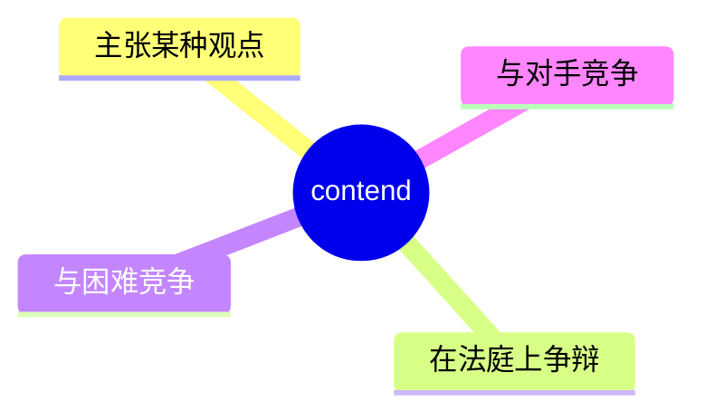
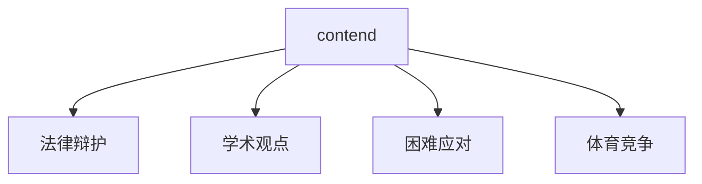
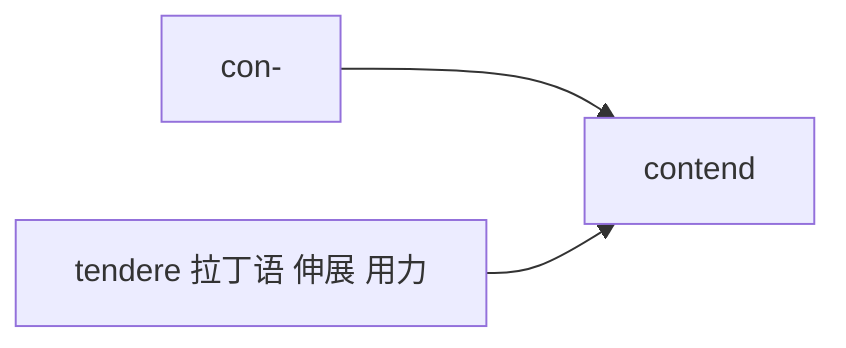

# contend

## 1. 单词卡片

| 项目 | 内容 |
|---|---|
| 单词 | contend |
| 词性 | verb |
| 英式音标 | /kənˈtend/ |
| 美式音标 | /kənˈtend/（基本相同） |
| 音节 | con-tend |
| 重音 | 第二音节 `tend` |
| 核心意思 | 主张、争辩；竞争、应对困难 |

## 2. 发音拆解


发音提示：

* 重音在第二个音节 `TEND`，读作 /tend/，元音是短元音 /e/
* 第一个音节弱读为 /kən/
* 词尾 `d` 要清晰发音，不要省略
* 中文近似音只能辅助记忆，不能代替标准发音：可理解为“肯腾德”，但真实发音更短促紧凑

## 3. 核心词义



## 4. 不同词性与用法

| 词性 | 英文含义 | 中文意思 | 常见结构 |
|---|---|---|---|
| verb | assert/argue that something is true | 主张、声称 | contend that |
| verb | struggle or compete | 应对、竞争 | contend with something |

## 5. 常见使用语境



## 6. 常见搭配

| 搭配 | 中文意思 | 使用场景 |
|---|---|---|
| contend that | 主张……、声称…… | 正式写作、辩论 |
| contend with | 应对、处理（困难） | 工作、生活 |
| contend for | 争夺、竞争（某物） | 体育、竞选 |
| lawyers contend | 律师主张 | 法律 |

## 7. 基础例句

**例句 1**

```text
Lawyers for the defense **contend** that the evidence was mishandled.
```

被告方律师主张证据被不当处理。

**例句 2**

```text
The company had to **contend** with rising costs last year.
```

去年公司不得不应对不断上涨的成本。

## 8. 问答例句

**Question**

```text
What do critics contend about this policy?
```

评论者对这项政策主张什么？

**Answer**

```text
They contend that it will hurt small businesses in the long run.
```

他们主张这从长远看会损害小企业的利益。

## 9. 工作场景

```text
Our team has had to **contend** with a tight deadline this quarter.
```

我们团队这个季度不得不应对紧迫的截止日期。

## 10. 日常生活场景

```text
Many families **contend** with high living costs in big cities.
```

很多家庭在大城市里应对着高昂的生活成本。

## 11. 词根词缀与构词



| 单词 | 词性 | 中文意思 |
|---|---|---|
| contend | verb | 主张、应对、竞争 |
| contention | noun | 争论、论点 |
| contentious | adjective | 有争议的 |
| contender | noun | 竞争者 |

`con-` 表示“共同、彼此”，词根 `tendere` 来自拉丁语“伸展、用力”，合起来表示“彼此用力争、争辩”。

## 12. 同义词辨析

| 单词 | 主要区别 |
|---|---|
| contend | 正式，可表示“主张”，也可表示“应对困难” |
| argue | 更口语化，强调争论、争吵 |
| assert | 强调坚定地陈述观点，不一定涉及争辩 |
| struggle | 强调努力应对困难，不涉及“主张观点” |

## 13. 反义词

没有非常固定的反义词，语境中常与以下概念相对：

| 单词 | 中文意思 |
|---|---|
| agree | 同意 |
| concede | 让步、承认 |

## 14. 易混淆点

```text
contend that
```

主张、声称（后接从句）。

```text
contend with
```

应对、处理（困难或问题）。

两个搭配意思完全不同，一定要注意后面跟的介词。

## 15. 常见错误

错误：

```text
He contends about the plan is wrong.
```

正确：

```text
He contends that the plan is wrong.
```

说明：

表示“主张……”应使用 `contend that + 从句`，不用 `contend about`。

## 16. 记忆方法

```text
con(彼此) + tend(用力、伸展) = contend（彼此用力争辩或竞争）
```

场景记忆：

```text
Lawyers for the defense contend that the evidence was mishandled.
被告方律师主张证据被不当处理。
```

## 17. 快速复习

| 问题 | 答案 |
|---|---|
| 核心意思是什么 | 主张、声称；应对、竞争 |
| 常见词性是什么 | 动词 |
| 常见搭配是什么 | contend that / contend with |
| 容易犯的错误是什么 | 误用 contend about，应为 contend that |
