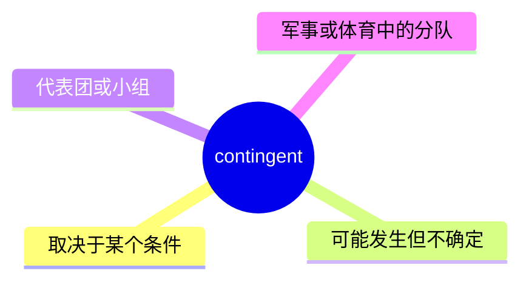
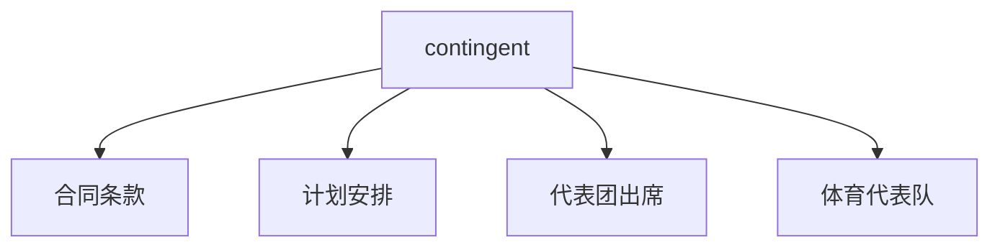
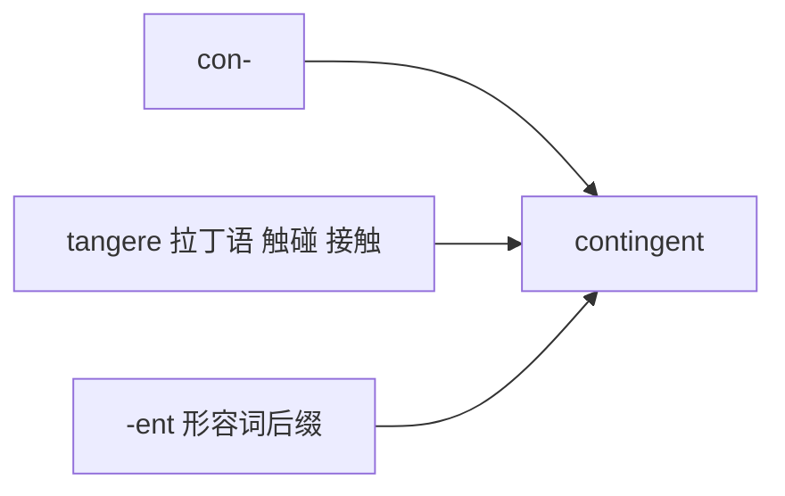

# contingent

## 1. 单词卡片

| 项目 | 内容 |
|---|---|
| 单词 | contingent |
| 词性 | adjective / noun |
| 英式音标 | /kənˈtɪndʒənt/ |
| 美式音标 | /kənˈtɪndʒənt/（基本相同） |
| 音节 | con-tin-gent |
| 重音 | 第二音节 `tin` |
| 核心意思 | 取决于……的、有条件的；（名词）代表团、一批人 |

## 2. 发音拆解


发音提示：

* 重音在第二个音节 `TIN`，读作 /tɪn/
* `gent` 读作 /dʒənt/，`g` 是浊辅音，类似汉语拼音的“奇”，但更浊
* 第一个音节弱读为 /kən/
* 中文近似音只能辅助记忆，不能代替标准发音：可理解为“肯听真特”，但真实发音更紧凑连贯

## 3. 核心词义



## 4. 不同词性与用法

| 词性 | 英文含义 | 中文意思 | 常见结构 |
|---|---|---|---|
| adjective | dependent on something else happening | 取决于……的、有条件的 | contingent on/upon |
| noun | a group representing a larger body | 代表团、一批人 | a large contingent |

## 5. 常见使用语境



## 6. 常见搭配

| 搭配 | 中文意思 | 使用场景 |
|---|---|---|
| contingent on/upon | 取决于…… | 正式写作、合同 |
| a large contingent | 一大批代表/人员 | 新闻、活动报道 |
| a contingent of soldiers | 一支部队 | 军事 |
| the French contingent | 法国代表团 | 国际活动 |

## 7. 基础例句

**例句 1**

```text
The picnic is **contingent** on the weather clearing up.
```

野餐是否举行取决于天气是否放晴。

**例句 2**

```text
A large **contingent** from the university attended the conference.
```

大学派出了一大批代表参加了这次会议。

## 8. 问答例句

**Question**

```text
Is your job offer contingent on passing the background check?
```

你的录用通知是不是取决于背景调查是否通过？

**Answer**

```text
Yes, the offer is contingent on a successful background check.
```

是的，这份录用通知取决于背景调查是否顺利通过。

## 9. 工作场景

```text
The project's success is **contingent** on getting approval from management.
```

这个项目能否成功取决于是否获得管理层的批准。

## 10. 日常生活场景

```text
Our trip is **contingent** on my brother getting time off work.
```

我们这次旅行取决于我弟弟能不能请到假。

## 11. 词根词缀与构词



| 单词 | 词性 | 中文意思 |
|---|---|---|
| contingent | adjective/noun | 有条件的；代表团 |
| contingency | noun | 意外情况、应急预案 |

`con-` 表示“共同”，词根来自拉丁语 `tangere`（触碰），引申为“彼此接触、相关联”，进一步引申为“取决于某种关联条件”。

## 12. 同义词辨析

| 单词 | 主要区别 |
|---|---|
| contingent | 正式，强调依赖某个条件才会发生 |
| dependent | 更常用，含义更广，不限于“条件” |
| conditional | 强调有明确的条件限制，常用于语法和合同语境 |

## 13. 反义词

| 单词 | 中文意思 |
|---|---|
| unconditional | 无条件的 |
| guaranteed | 有保证的 |

## 14. 易混淆点

```text
contingent (adjective)
```

取决于某条件的，常用 contingent on/upon。

```text
contingency (noun)
```

意外情况、应急预案，比如 contingency plan（应急计划）。

## 15. 常见错误

错误：

```text
The plan is contingent to good weather.
```

正确：

```text
The plan is contingent on good weather.
```

说明：

`contingent` 后面固定搭配介词 `on` 或 `upon`，不用 `to`。

## 16. 记忆方法

```text
con(共同) + tin(触碰，来自 tangere) + gent(形容词后缀) = contingent（彼此关联、取决于条件的）
```

场景记忆：

```text
The picnic is contingent on the weather clearing up.
野餐是否举行取决于天气是否放晴。
```

## 17. 快速复习

| 问题 | 答案 |
|---|---|
| 核心意思是什么 | 取决于……的；代表团、一批人 |
| 常见词性是什么 | 形容词、名词 |
| 常见搭配是什么 | contingent on/upon / a large contingent |
| 容易犯的错误是什么 | 介词误用为 to，应为 on/upon |
